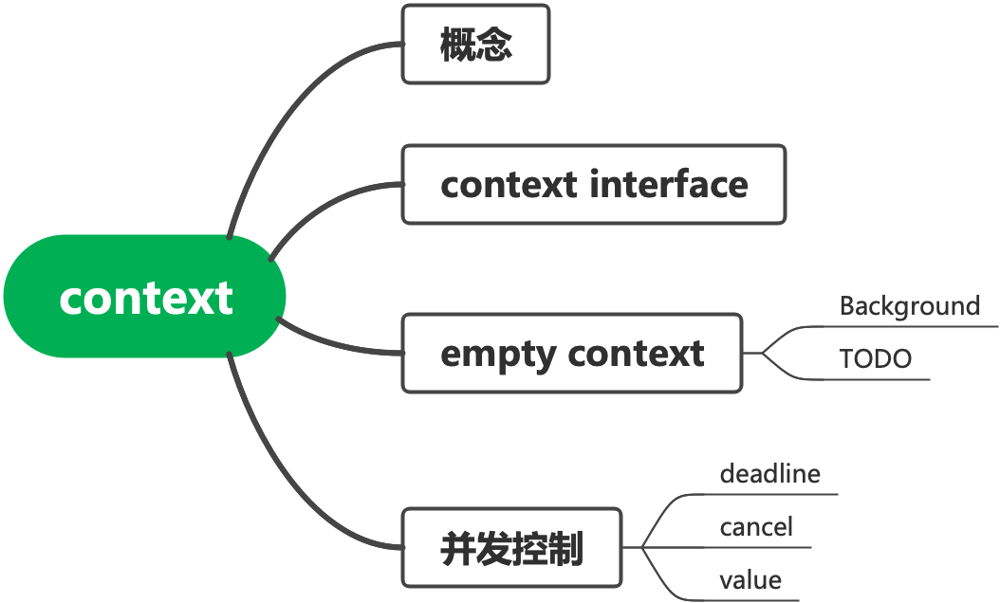
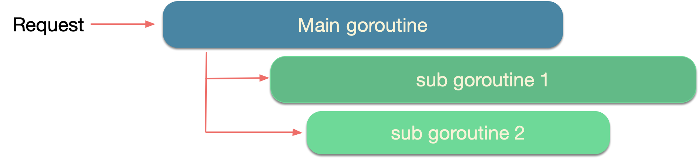
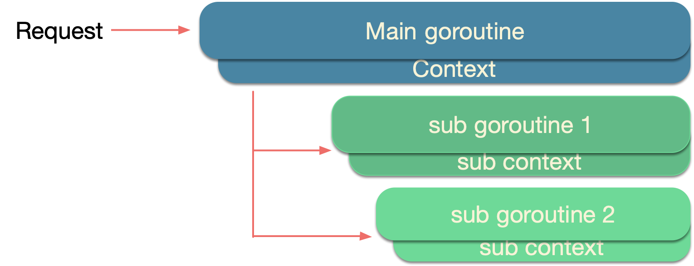

# context

## 上下文

上下文即为语境，对运行中的进程、线程及协程而言，即为各个变量及数据。在go中，每个请求都由单独的一个协程进行处理，处理过程会启用新的协程进行辅助（例如：访问数据库和调用其他服务），处理请求的协程及其派生出的子协程通常需要访问特定的值（例如：用户的身份信息、token、traceId及请求的超时限制等），当请求被取消或者超时时，所有该请求相关的协程都应该快速退出，以便系统可以回收相关的资源。

## go context

go提供了context包，可以很便利地将取消信号、超时时间及其他的信息传递给所有相关的协程。

~~~go
type Context interface {
	/**
	 *  Deadline
	 *  @Description:获得协程的超时时间
	 *  @return time 协程的超时时间点
	 *  @return ok	如果未设置超时时间，则返回fasle
	 */
	Deadline() (deadline time.Time, ok bool)
	/**
	 *  Done
	 *  @Description:判断context是否被取消
	 *  @return <-chan 返回一个关闭的channel，与此context及子context相关的正在运行的协程应该退出
	 */
	Done() <-chan struct{}
	/**
	 *  Err
	 *  @Description:如果ctx没有被关闭，返回一个nil，如果ctx关闭，返回取消原因
	 *  @return error
	 */
	Err() error
	/**
	 *  Value
	 *  @Description:返回ctx中携带的值
	 *  @param key
	 *  @return interface{}
	 */
	Value(key interface{}) interface{}
}
~~~

如图所示，每一个请求会创建一个goroutine进行处理，在处理的过程中会创建子协程进行协助。如图所示，请求进来后，会首先创建一个主协程进行处理，在处理过程中会创建子协程进行协助，如果不适用context进行流程，会出现其中某一个协程出现错误之后，其他的协程由于未接收到错误的信号继续执行，导致资源浪费。

使用context进行并发控制能够在某一协程出现错误之后及时地将信息同步至其他协程，从而可以使还在运行中的协程退出，减少资源的浪费。

协程之间存在层级关系，为树状结构，上层的协程应该有能力控制子协程的退出，因此context之间也应该有相似的树状结构。context包中提供了两种类型的context根节点：`background`和`todo`,这两种类型的context都是`emptyContext`的实例。

~~~go
type emptyCtx int

func (*emptyCtx) Deadline() (deadline time.Time, ok bool) {
	return
}

func (*emptyCtx) Done() <-chan struct{} {
	return nil
}

func (*emptyCtx) Err() error {
	return nil
}

func (*emptyCtx) Value(key interface{}) interface{} {
	return nil
}

func (e *emptyCtx) String() string {
	switch e {
	case background:
		return "context.Background"
	case todo:
		return "context.TODO"
	}
	return "unknown empty Context"
}

var (
	background = new(emptyCtx)
	todo       = new(emptyCtx)
)

func Background() Context {
	return background
}

func TODO() Context {
	return todo
}
~~~

emptyContext实现了Context接口中定义的所有方法，但却没有任何功能。`context.Background`和 `context.TODO`也只是互为别名，没有太大的差别，只是在使用和语义上稍有不同：

- `context.Background` 是上下文的默认值，所有其他的上下文都应该从它衍生出来；
- `context.TODO`应该仅在不确定应该使用哪种上下文时使用；

在多数情况下，如果当前函数没有上下文作为入参，我们都会使用 `context.Background`作为起始的上下文向下传递。

## 并发控制

### WithCancel

context.WithCancel()可以由context生成一个新的子context，并返回取消该context的函数。执行取消函数，则由父context派生出的所有子上下文都会被取消，所有的协程都会收到这个信号。

~~~go
var wg = sync.WaitGroup{}

func cancel(ctx context.Context) {
	cctx, cancel := context.WithCancel(ctx)
	wg.Add(1)
	go work(cctx, "1")
	time.Sleep(20 * time.Millisecond)
	cancel()
	wg.Wait()
}

func work(ctx context.Context, name string) {
	defer wg.Done()
	cctx, _ := context.WithCancel(ctx)
	wg.Add(1)
	go work2(cctx, "2")
	for {
		select {
		case <-ctx.Done():
			fmt.Println(name + " goroutine finish")
			return
		default:
			fmt.Println(name + " goroutine is running")
		}
		time.Sleep(10 * time.Millisecond)
	}
}

func work2(ctx context.Context, name string) {
	time.Sleep(9 * time.Millisecond)
	defer wg.Done()
	for {
		select {
		case <-ctx.Done():
			fmt.Println(name + " goroutine finish")
			return
		default:
			fmt.Println(name + " goroutine is running")
		}
		time.Sleep(10 * time.Millisecond)
	}
}

//result:
1 goroutine is running
2 goroutine is running
1 goroutine is running
2 goroutine is running
1 goroutine finish
2 goroutine finish
~~~

~~~go
//定义了可被取消的context接口，提供了cancel()方法用于取消context，Done()接口判断是否已被取消
type canceler interface {
	cancel(removeFromParent bool, err error)
	Done() <-chan struct{}
}
//实现canceler接口
type cancelCtx struct {
	Context

	mu       sync.Mutex            // 保证并发安全
	done     chan struct{}         // 懒加载，第一次被取消时生成
	children map[canceler]struct{} // set to nil by the first cancel call
	err      error                 // set to non-nil by the first cancel call
}
func (c *cancelCtx) Value(key interface{}) interface{} {
	if key == &cancelCtxKey {
		return c
	}
	return c.Context.Value(key)
}

func (c *cancelCtx) Done() <-chan struct{} {
	c.mu.Lock()
	if c.done == nil {
		c.done = make(chan struct{})
	}
	d := c.done
	c.mu.Unlock()
	return d
}

func (c *cancelCtx) Err() error {
	c.mu.Lock()
	err := c.err
	c.mu.Unlock()
	return err
}

func WithCancel(parent Context) (ctx Context, cancel CancelFunc) {
	if parent == nil {
		panic("cannot create context from nil parent")
	}
	c := newCancelCtx(parent)//由parent context生成一个cancel context
	propagateCancel(parent, &c)//将parent的取消状态传递给子context
	return &c, func() { c.cancel(true, Canceled) }
}

func newCancelCtx(parent Context) cancelCtx {
	return cancelCtx{Context: parent}
}

func (c *cancelCtx) cancel(removeFromParent bool, err error) {
	if err == nil {
		panic("context: internal error: missing cancel error")
	}
	c.mu.Lock()
	if c.err != nil { //c.err!=nil表示已经被取消
		c.mu.Unlock()
		return 
	}
	c.err = err
	if c.done == nil {
		c.done = closedchan
	} else {
		close(c.done)
	}
	for child := range c.children {
		child.cancel(false, err)
	}
	c.children = nil
	c.mu.Unlock()

	if removeFromParent {
		removeChild(c.Context, c)//使子context与父context脱离关系
	}
}

~~~

### WithDeadline & WithTimeout

`withDeadline()`和`WithTimeout()`都是用来做超时控制，超时后，从父context中派生出的所有子context会被自动取消。其中，`withDeadline()`指定超时的时间点，`WithTimeout()`指定超时的时间段。

~~~go
var wg = sync.WaitGroup{}
func deadline(ctx context.Context) {
	ctx, cancel := context.WithDeadline(ctx, time.Now().Add(time.Second))
	wg.Add(1)
	go func(ctx context.Context, cancel func()) {
		defer wg.Done()
		for  {
			select {
			case <-ctx.Done():
				fmt.Println( " goroutine finish")
				return
			default:
				fmt.Println( " goroutine is running ")
				time.Sleep(200*time.Millisecond)
			}
		}

	}(ctx, cancel)
	wg.Wait()
	select {
	case <-ctx.Done():
		fmt.Println( " parent goroutine finish")
	default:
		fmt.Println( "parent goroutine is not finish")
	}
}
/*result:
 goroutine is running 
 goroutine is running 
 goroutine is running 
 goroutine is running 
 goroutine is running 
 goroutine finish
 parent goroutine finish
*/

func timeout(ctx context.Context){
	cctx ,cancel:=context.WithTimeout(ctx,time.Second)
	wg.Add(1)
	go func(ctx context.Context, cancel func()) {
		defer wg.Done()
		for  {
			select {
			case <-ctx.Done():
				fmt.Println( " goroutine finish")
				return
			default:
				fmt.Println( " goroutine is running ")
				time.Sleep(200*time.Millisecond)
			}
		}

	}(cctx, cancel)
	wg.Wait()
	select {
	case <-ctx.Done():
		fmt.Println( " parent goroutine finish")
	default:
		fmt.Println( "parent goroutine is not finish")
	}
}
/*result
 goroutine is running 
 goroutine is running 
 goroutine is running 
 goroutine is running 
 goroutine is running 
 goroutine finish
 parent goroutine finish
 */
~~~

实际上`WithTimeout()`调用了`WithDeadline()`：

~~~go
func WithTimeout(parent Context, timeout time.Duration) (Context, CancelFunc) {
	return WithDeadline(parent, time.Now().Add(timeout))
}
~~~

**注意**

无论是withCancel、withDeadline和withTimeout，在取消的时候，只会取消由其派生出的子context，其自身并不会被取消。

~~~go
type timerCtx struct {
	cancelCtx
	timer *time.Timer // Under cancelCtx.mu.

	deadline time.Time
}

func WithDeadline(parent Context, d time.Time) (Context, CancelFunc) {
	if parent == nil {
		panic("cannot create context from nil parent")
	}
	if cur, ok := parent.Deadline(); ok && cur.Before(d) { //是否已经设置过过期时间，且设置的过期时间早与新的过期时间
		return WithCancel(parent)
	}
	c := &timerCtx{
		cancelCtx: newCancelCtx(parent),
		deadline:  d,
	}
	propagateCancel(parent, c)
	dur := time.Until(d)
	if dur <= 0 {//当前时间已超过过期时间，直接取消
		c.cancel(true, DeadlineExceeded) // deadline has already passed
		return c, func() { c.cancel(false, Canceled) }
	}
	c.mu.Lock()
	defer c.mu.Unlock()
	if c.err == nil {
    c.timer = time.AfterFunc(dur, func() {创建定时器，当时间超过截止日期后会调用cancel()同步取消信号
			c.cancel(true, DeadlineExceeded)
		})
	}
	return c, func() { c.cancel(true, Canceled) }
}

~~~

### WithValue

`WithValue()`可从父context创建一个携带数据的子上下文用于传值。

~~~go
type valueCtx struct {
	Context
	key, val interface{}
}
func WithValue(parent Context, key, val interface{}) Context {
	if parent == nil {
		panic("cannot create context from nil parent")
	}
	if key == nil {
		panic("nil key")
	}
	if !reflectlite.TypeOf(key).Comparable() {
		panic("key is not comparable")
	}
	return &valueCtx{parent, key, val}
}
func (c *valueCtx) Value(key interface{}) interface{} {
	if c.key == key {
		return c.val
	}
	return c.Context.Value(key)
}
~~~

## context使用原则

* Context 不要放在结构体中，需要以参数方式传递
* Context 作为函数参数时，要放在第一位，作为第一个参数，且命名为ctx
* 即使函数允许也不传递nil的context。如果不知道使用何种context，选择`context.TODO()`
* 谨慎使用context的Value，仅使用在进程及接口的数据传递场景，避免在函数中进行相关操作

## 参考

* https://pkg.go.dev/context

* https://go.dev/blog/context

* [Go 语言设计与实现](https://draveness.me/golang/docs/part3-runtime/ch06-concurrency/golang-context/#612-%E9%BB%98%E8%AE%A4%E4%B8%8A%E4%B8%8B%E6%96%87)

* [Go 语言42章经](https://wizardforcel.gitbooks.io/go42/content/content/42_37_context.html)

  
